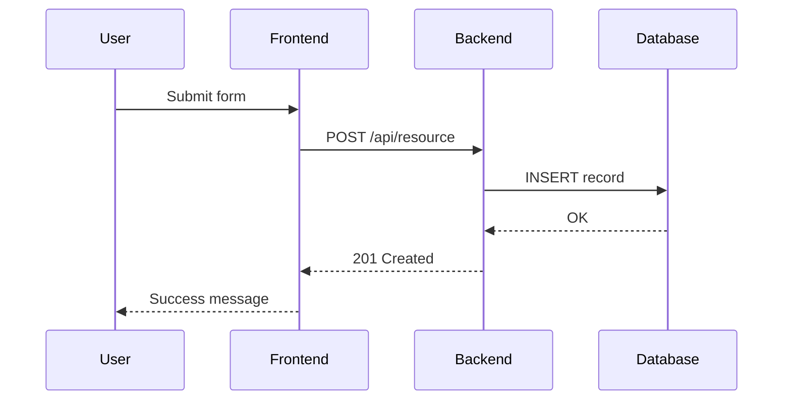

# Functional Requirements Document — `<Tên Module/Feature>`

> Template chuẩn IIBA. FRD = chi tiết "WHAT hệ thống làm" — derive từ BRD.

---

## Document Control

| Field | Value |
|---|---|
| Document ID | FRD-`<YYYY>`-`<###>` |
| Related BRD | BRD-`<YYYY>`-`<###>` |
| Version | 1.0 |
| Status | Draft / Review / Approved |
| Owner | `<Tên BA>` |
| Created | `<YYYY-MM-DD>` |

---

## 1. Introduction

### 1.1 Purpose
`<FRD này mô tả chi tiết function của module X.>`

### 1.2 Scope
`<In-scope module/feature này — link tới BR-XXX trong BRD.>`

### 1.3 Definitions & Acronyms
| Term | Meaning |
|---|---|
| `<Term>` | `<Definition>` |

---

## 2. Functional Requirements

### Format chuẩn

> "Hệ thống PHẢI [verb] [object] [condition/constraint]"

### Group 1: `<Feature Group Name>`

| ID | Functional Requirement | Source BR | Priority | AC Reference |
|---|---|---|---|---|
| FR-001 | Hệ thống PHẢI cho phép user `<action>` khi `<condition>` | BR-001 | M | §3.1 |
| FR-002 | Hệ thống PHẢI validate `<input>` theo rule `<X>` | BR-001 | M | §3.2 |
| FR-003 | Hệ thống PHẢI gửi notification qua `<channel>` khi `<event>` | BR-002 | S | §3.3 |

### Group 2: `<Another Feature Group>`

| ID | Functional Requirement | Source BR | Priority | AC Reference |
|---|---|---|---|---|
| FR-010 | `<...>` | BR-002 | M | §3.4 |

---

## 3. Acceptance Criteria

### 3.1 FR-001: `<Tên FR>`

**Given** user đã đăng nhập với role `<role>`,
**When** user click `<button>` và submit form hợp lệ,
**Then** hệ thống lưu record vào database và hiển thị message thành công trong ≤2 giây.

**Edge cases:**
- Input không hợp lệ → hiển thị inline validation error
- Network timeout → retry 3 lần, sau đó báo "Vui lòng thử lại"

### 3.2 FR-002: `<Tên FR>`

`<Given-When-Then>`

---

## 4. Process Flow

### 4.1 Main Flow (BPMN/Sequence diagram)



### 4.2 Alternative / Exception Flows

`<Mô tả các nhánh phụ và exception>`

---

## 5. Data Model

### 5.1 Entities

```
User {
  id: UUID (PK)
  email: string (unique, required)
  role: enum [admin, member, guest]
  created_at: timestamp
}

Order {
  id: UUID (PK)
  user_id: UUID (FK → User.id)
  total_amount: decimal(15,2)
  status: enum [pending, paid, cancelled]
  created_at: timestamp
}
```

### 5.2 Relationships

- `User 1 ──< N Order` (one user, many orders)

---

## 6. UI / UX Requirements

### 6.1 Wireframes
`<Link tới Figma / wireframe>`

### 6.2 UI States

| State | Trigger | Display |
|---|---|---|
| Loading | API request in-flight | Spinner |
| Success | API 200 | Toast success |
| Error | API 4xx/5xx | Inline error message |
| Empty | No data | Empty state with CTA |

---

## 7. External Interfaces

### 7.1 API Specifications

| Endpoint | Method | Request | Response |
|---|---|---|---|
| `/api/users` | POST | JSON {email, password} | 201 {id, email, token} |
| `/api/users/:id` | GET | Authorization header | 200 {user} or 404 |

### 7.2 Third-Party Integrations

| Service | Purpose | Auth | Rate Limit |
|---|---|---|---|
| Google OAuth | Authentication | OAuth 2.0 | 10K/day |
| SendGrid | Email | API Key | 100/sec |

---

## 8. Business Rules

| Rule ID | Description | Applies To |
|---|---|---|
| BR-R001 | User chỉ có thể có 1 active session/device | FR-001 |
| BR-R002 | Order >50M VNĐ phải có approval của admin | FR-010 |

---

## 9. Traceability Matrix

| FR-ID | BR-ID | Test Case(s) | Status |
|---|---|---|---|
| FR-001 | BR-001 | TC-045 | Todo |
| FR-002 | BR-001 | TC-046 | Todo |
| FR-003 | BR-002 | TC-050 | Todo |

---

## 10. Approval

| Role | Name | Date |
|---|---|---|
| BA | `<Tên>` | |
| Tech Lead | `<Tên>` | |
| QA Lead | `<Tên>` | |
