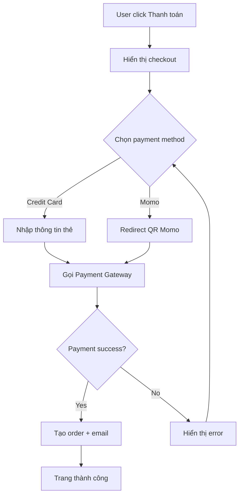

# Use Case Template — IIBA Standard

> Mô tả chi tiết tương tác user-system. Dùng khi flow phức tạp, có nhiều
> nhánh, hoặc cần spec cho dev/QA chính xác hơn user story.

---

## UC-`<XXX>`: `<Tên Use Case — verb + object>`

### Metadata

| Field | Value |
|---|---|
| Use Case ID | UC-`<XXX>` |
| Version | 1.0 |
| Author | `<BA name>` |
| Date | `<YYYY-MM-DD>` |
| Status | Draft / Review / Approved |
| Source FR / BR | FR-`<XXX>` / BR-`<XXX>` |
| Priority | `<M / S / C / W>` |

---

### 1. Brief Description

`<2-3 câu mô tả ngắn use case làm gì.>`

---

### 2. Actors

| Type | Name | Description |
|---|---|---|
| Primary Actor | `<Khách hàng>` | Người trực tiếp dùng UC |
| Secondary Actor | `<Hệ thống Payment Gateway>` | System bên ngoài tham gia |
| Stakeholder (off-stage) | `<Admin>` | Không tương tác trực tiếp nhưng quan tâm |

---

### 3. Goal

`<1 câu — mục tiêu mà primary actor đạt được sau khi UC hoàn thành.>`

**Đo lường:** `<Cách verify goal đạt được: data trong DB, message UI, ...>`

---

### 4. Trigger

`<Sự kiện kích hoạt UC. VD: User click "Mua ngay", Cron job 9h sáng, Webhook từ X.>`

---

### 5. Pre-conditions

> State hệ thống PHẢI thoả trước khi UC bắt đầu.

- ✅ User đã đăng nhập
- ✅ Giỏ hàng có ≥1 item
- ✅ Tồn kho ≥ số lượng đặt
- ✅ User có địa chỉ giao hàng default

---

### 6. Post-conditions

#### 6.1 Success Post-condition
> State sau khi UC hoàn thành thành công.

- ✅ Đơn hàng được tạo với status `pending_payment`
- ✅ Tồn kho giảm đúng số lượng
- ✅ Email xác nhận gửi tới user
- ✅ Audit log ghi action

#### 6.2 Failure Post-condition
> State khi UC fail (trong exception flow).

- Tồn kho không thay đổi
- Đơn hàng không được tạo
- User được thông báo lý do fail

---

### 7. Main Flow (Basic Flow / Happy Path)

> Đánh số bước. Mỗi bước = 1 câu, 1 hành động cụ thể.

| # | Actor | Action |
|---|---|---|
| 1 | User | Click "Thanh toán" trên giỏ hàng |
| 2 | System | Hiển thị trang checkout với địa chỉ default + danh sách item |
| 3 | User | Chọn phương thức thanh toán (Credit Card) |
| 4 | User | Nhập thông tin thẻ và click "Xác nhận" |
| 5 | System | Validate thông tin thẻ ở client |
| 6 | System | Gọi Payment Gateway với token thẻ |
| 7 | Payment Gateway | Xử lý giao dịch và trả về `success` |
| 8 | System | Tạo Order record với status `paid` |
| 9 | System | Gửi email xác nhận đơn hàng |
| 10 | System | Hiển thị trang "Đặt hàng thành công" với mã đơn |

---

### 8. Alternative Flows (A1, A2, ...)

> Nhánh phụ vẫn dẫn tới success — chỉ đường đi khác.

#### A1. Thanh toán bằng Momo (thay vì Credit Card)

**Nhánh từ:** Step 3 (User chọn phương thức)

| # | Actor | Action |
|---|---|---|
| A1.1 | User | Chọn "Momo" |
| A1.2 | System | Redirect tới trang QR Momo |
| A1.3 | User | Quét QR và xác nhận trong app Momo |
| A1.4 | Momo Gateway | Webhook callback `success` |
| A1.5 | System | Tiếp tục từ Step 8 (Main Flow) |

#### A2. Apply mã giảm giá

**Nhánh từ:** Step 2

| # | Actor | Action |
|---|---|---|
| A2.1 | User | Nhập mã giảm giá vào ô "Mã khuyến mãi" |
| A2.2 | System | Validate mã + cập nhật tổng tiền |
| A2.3 | — | Tiếp tục Step 3 (Main Flow) |

---

### 9. Exception Flows (E1, E2, ...)

> Flow khi có lỗi — kết thúc với failure post-condition.

#### E1. Thẻ không hợp lệ / không đủ tiền

**Trigger:** Step 7 — Payment Gateway trả về `declined`

| # | Actor | Action |
|---|---|---|
| E1.1 | System | Nhận response `declined` từ Payment Gateway |
| E1.2 | System | Rollback (không tạo order) |
| E1.3 | System | Hiển thị message: "Thanh toán không thành công. Vui lòng kiểm tra lại thông tin thẻ hoặc thử phương thức khác." |
| E1.4 | User | Có thể quay lại Step 3 hoặc cancel |

#### E2. Tồn kho hết giữa chừng

**Trigger:** Step 8 — System detect tồn kho < số lượng đặt (race condition)

| # | Actor | Action |
|---|---|---|
| E2.1 | System | Refund qua Payment Gateway |
| E2.2 | System | Hiển thị: "Sản phẩm vừa hết hàng. Tiền đã được hoàn về tài khoản trong 1-3 ngày." |
| E2.3 | System | Gửi email xin lỗi |

#### E3. Network timeout với Payment Gateway

**Trigger:** Step 6 — Timeout >30s

| # | Actor | Action |
|---|---|---|
| E3.1 | System | Retry tối đa 3 lần với exponential backoff |
| E3.2 | System | Nếu vẫn fail → log incident + alert ops team |
| E3.3 | System | Hiển thị: "Hệ thống đang bận. Vui lòng thử lại sau ít phút." |

---

### 10. Business Rules

| Rule ID | Description | Applies to Step |
|---|---|---|
| BR-R001 | Đơn hàng > 5,000,000 VNĐ phải xác thực OTP | Step 4 |
| BR-R002 | Mã giảm giá tối đa 30% giá trị đơn | A2.2 |
| BR-R003 | Tồn kho hold trong 15 phút từ Step 1 | Step 1-8 |

---

### 11. Special Requirements

- **Performance:** Step 6-7 phải hoàn tất trong ≤5s (95th percentile)
- **Security:** Thông tin thẻ KHÔNG lưu trong system (PCI-DSS)
- **Audit:** Mọi giao dịch log vào audit_log table

---

### 12. Frequency

`<Estimate: 100 lần/ngày, peak 500 lần/giờ vào campaign>`

---

### 13. Open Issues

- ❓ Refund policy chi tiết khi E2 xảy ra?
- ❓ Có cần fallback Payment Gateway thứ 2?

---

### 14. Visual Flow (Activity Diagram)

---

### 15. Related Use Cases

- **Includes:** UC-005 (Validate cart)
- **Extends:** UC-020 (Apply coupon)
- **Generalization:** UC-001 (Generic Payment)
