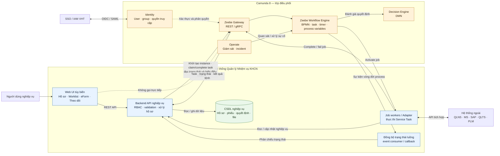

# Sơ đồ quan hệ giữa Camunda 8 và hệ thống Quản lý NVKH

## Ranh giới trách nhiệm

- Hệ thống Quản lý NVKH là nguồn dữ liệu nghiệp vụ: hồ sơ, biểu mẫu, phiếu, quyết định và file.
- Camunda là nguồn trạng thái luồng: bước hiện tại, người/nhóm xử lý, thời hạn, nhánh và sự cố.
- Frontend chỉ gọi Backend API, không kết nối trực tiếp Camunda.
- Backend điều khiển instance và User Task qua Zeebe Gateway; Job Worker thực thi Service Task và tích hợp hệ thống ngoài.
- Hai phía tương quan bằng `maHoSo`; Camunda chỉ giữ ID và các biến điều khiển cần thiết.

> Trạng thái thiết kế: mô hình triển khai Camunda SaaS hay Self-Managed vẫn cần được chốt; sơ đồ này thể hiện quan hệ logic, không phụ thuộc mô hình triển khai vật lý.
