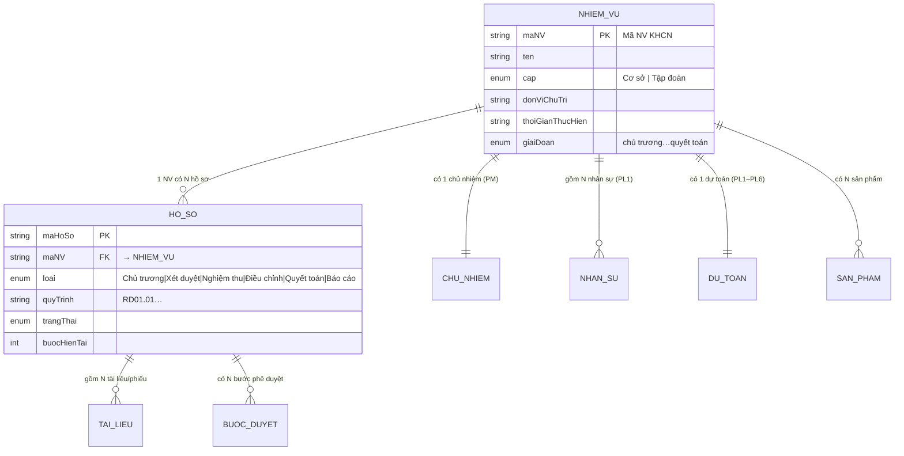

# Mô hình dữ liệu: Nhiệm vụ KHCN ↔ Hồ sơ

> Phân tích bám tài liệu `1. Quy trinh Phan mem KHCN chi tiet (clean).md` (bản clean từ PDF gốc).
> Mục tiêu: làm rõ **"Hồ sơ nhiệm vụ" có phải là "Nhiệm vụ KHCN" không** và **các trường thông tin**
> của mỗi thực thể — làm nền cho data model của phần mềm QTKHCN.
>
> Ngày lập: 03/07/2026 · Nguồn: mục 1–10 + Phụ lục viết tắt của tài liệu quy trình.

---

## 1. Kết luận: KHÔNG phải một — quan hệ 1 – N

**Nhiệm vụ KHCN (NV KHCN / đề tài)** và **Hồ sơ (HS)** là **hai thực thể khác cấp**:

| | **Nhiệm vụ KHCN (master)** | **Hồ sơ (instance)** |
|---|---|---|
| Bản chất | Đối tượng quản lý **xuyên suốt vòng đời** | **Gói tài liệu của MỘT luồng nghiệp vụ** tại một giai đoạn |
| Số lượng | **1** đề tài | **N** hồ sơ trên cùng 1 đề tài |
| Định danh | **Mã NV KHCN** — khóa ổn định, đồng bộ NS/MS/SAP/QLTS/PLM | Mã hồ sơ theo từng luồng |
| Sinh ra khi | RD01 — *"Sự kiện bắt đầu: Khởi tạo nhiệm vụ"* | Mỗi luồng có bước *"Khởi tạo hồ sơ"* |
| Vòng đời | Chủ trương → Xét duyệt → Thực hiện → Điều chỉnh → Nghiệm thu → Quyết toán | Đóng khi luồng tương ứng kết thúc |

### Bằng chứng trong tài liệu
- **Phụ lục viết tắt** phân biệt rạch ròi: `NV KHCN = Nhiệm vụ Khoa học Công nghệ` ≠ `HS/HSXD/HSĐC = Hồ sơ / Hồ sơ xây dựng / Hồ sơ điều chỉnh`.
- Một đề tài đi qua **nhiều loại hồ sơ**: HS chủ trương (RD01) → HSXD (RD02) → HS báo cáo (RD03.6) → HSĐC / HS tạm dừng / HS dừng (RD04) → HS nghiệm thu (RD05) → HS quyết toán (RD06) → HS ĐGHT. Mỗi luồng "Khởi tạo hồ sơ" một lần → **nhiều hồ sơ trên một NV**.
- Ràng buộc bắc cầu giữa các luồng, tất cả trỏ về **cùng một NV KHCN**:
  - RD02: *"Điều kiện ràng buộc: Có quyết định phê duyệt chủ trương cấp cơ sở"*.
  - RD05: *"…các nội dung thực hiện đề tài … hoàn thành"*.
  - RD06: *"NV KHCN có Quyết định nghiệm thu"*.
- Toàn bộ bảng tích hợp RD03 (NS/MS/SAP/QLTS/PLM) đều khóa theo **"Tên, Mã NV KHCN"** → NV KHCN là **master xuyên hệ thống**; hồ sơ chỉ là vật mang nghiệp vụ theo từng giai đoạn.

---

## 2. Sơ đồ thực thể (ERD)



**ASCII (fallback):**

```
NHIỆM VỤ KHCN (1) ────< HỒ SƠ (N)
  ├─ 1 Chủ nhiệm (PM)              ├─< Tài liệu/Phiếu (N)
  ├─ N Nhân sự (PL1)              └─< Bước phê duyệt (N)
  ├─ 1 Dự toán (PL1–PL6)
  └─ N Sản phẩm / Milestone
```

---

## 3. Trường thông tin — Nhiệm vụ KHCN (master)

*Explicit — trích từ các bảng "Thông tin khởi tạo" mục 3 (RD03, tích hợp NS/MS/SAP/QLTS/PLM).*

| Nhóm | Trường |
|---|---|
| **Định danh** | Mã NV KHCN, Tên NV KHCN |
| **Chủ nhiệm (PM)** | Mã nhân viên, Họ tên, Email, Số điện thoại, ĐV công tác, Học hàm, Học vị, Chức danh khoa học |
| **Tổ chức** | Đơn vị chủ trì; TT/Khối |
| **Thời gian** | Thời gian thực hiện (bắt đầu – kết thúc) |
| **Cấp** | Cơ sở / Tập đoàn |
| **Nhân sự (PL1)** | Danh sách nhân sự (MNV), Tổng số công dự kiến / ULNL (Man-Month), hệ số lương, chi phí lương phân bổ, trạng thái nhân sự |
| **Cấu trúc sản phẩm (PL2)** | System → Subsystem → Module → SubModule → VTLK |
| **Kế hoạch & sản phẩm** | Kế hoạch thực hiện, Milestone, Danh sách sản phẩm, sơ đồ khối sản phẩm, tiến độ/kết quả |
| **Dự toán** | Dự toán tổng (PL1–PL6) |

### Cơ cấu Dự toán (PL)
| Phụ lục | Nội dung | Trạng thái |
|---|---|---|
| **PL1** | Chi phí nhân công / lương | ✅ explicit |
| **PL2** | Dự toán theo cấu trúc sản phẩm / VTLK | ✅ explicit |
| **PL3, PL4, PL5** | Các hạng mục mua sắm khác: tờ trình, hợp đồng, chi phí | ✅ explicit |
| **PL6** | *Chưa định nghĩa riêng — tài liệu chỉ gộp "PL1–PL6"* | 🔴 **gap — cần khách xác nhận** |

### Dữ liệu tích lũy khi thực hiện (đồng bộ ngoài, khóa theo Mã NV)
- **Mua sắm (MS):** tờ trình (số/ngày/tên/kinh phí), gói thầu (KHLCNT, ngày phát thầu, KQ LCNT, giá trị trúng thầu, đối tác), hợp đồng (số/nội dung/ngày duyệt/đối tác/tình trạng/giá trị).
- **Tài sản (QLTS):** VTLK, CCDC, TS — số lượng, đơn giá, thành tiền; cá nhân/đơn vị nhận; số/ngày Phiếu NXK.
- **Chi phí (SAP):** kinh phí đã thực hiện/đã quyết toán theo PL1–PL6; kinh phí phát sinh theo cấu trúc sản phẩm.
- **Tiến độ/sản phẩm (PLM):** tiến độ, kết quả theo kế hoạch; kết quả theo sơ đồ khối/DS sản phẩm.

---

## 4. Trường thông tin — Hồ sơ (instance mỗi luồng)

*Suy dẫn — tài liệu KHÔNG có bảng "trường hồ sơ" riêng; tổng hợp từ các luồng RD01–RD06.*

| Nhóm | Trường |
|---|---|
| **Định danh** | Mã hồ sơ; Loại hồ sơ (Chủ trương / Xét duyệt / Báo cáo / Điều chỉnh / Tạm dừng / Dừng / Nghiệm thu / Quyết toán / ĐGHT); Cấp (CS/TĐ) |
| **Liên kết** | Mã + Tên NV KHCN (FK → Nhiệm vụ) |
| **Khởi tạo** | Người khởi tạo (PM/PA/NNC), Đơn vị (TT/Khối), Ngày tạo |
| **Trạng thái luồng** | Bước hiện tại, trạng thái, lịch sử ký duyệt, hạn xử lý (SLA) |
| **Tài liệu thành phần** | Thuyết minh; Dự toán (PL1–6); Phiếu nhận xét (PNX); Phiếu đánh giá (PĐG); Biên bản họp phiên 1/2 (BB); Báo cáo thẩm định; Công văn (CV); Quyết định (QĐ TLHĐ, QĐ phê duyệt/công nhận); ý kiến thẩm định trực tiếp; trạng thái Đạt/Chưa đạt |

> **Thuyết minh đề tài:** tài liệu có nhắc ("Nội dung nghiên cứu trong thuyết minh") nhưng **không liệt kê chi tiết trường**. Mẫu chi tiết ở **RD10 – "Form mẫu hồ sơ đề tài"** → cần lấy form mẫu để bóc trường (mục tiêu, nội dung nghiên cứu, sản phẩm, phương án kỹ thuật…).

---

## 5. Độ tin cậy & khoảng trống

| Nội dung | Độ tin cậy |
|---|---|
| NV KHCN ≠ Hồ sơ (quan hệ 1–N) | ✅ Cao (nhiều bằng chứng) |
| Trường NV KHCN master (mục 3) | ✅ Cao (bảng tích hợp explicit) |
| Trường Hồ sơ (mục 4) | 🟠 Trung bình (suy dẫn — không có bảng gốc) |
| Định nghĩa **PL6** | 🔴 Gap |
| Trường chi tiết **Thuyết minh** (RD10) | 🔴 Gap — chờ form mẫu |
| Quy tắc **Mã NV KHCN / Mã hồ sơ** | 🔴 Gap |

---

## 6. Hệ quả cho data model phần mềm (webapp)

Phải tách **2 bảng** thay vì gộp:

- **`NhiemVu`** (master): định danh + chủ nhiệm + đơn vị + thời gian + cấp + dự toán + giai đoạn vòng đời.
- **`HoSo`** (instance): FK `maNV` + loại hồ sơ + quy trình + bước/trạng thái + tài liệu.

Quan hệ **1 `NhiemVu` — N `HoSo`**. UI có thể hiển thị **view join** (hồ sơ + thông tin đề tài) cho tiện, nhưng lưu trữ phải chuẩn hoá theo 2 bảng.

> Đã hiện thực trong `webapp/src/data/nhiemVu.ts` (master) + `webapp/src/data/dossiers.ts` (HoSo + view join),
> nối qua `store/DossierContext`.
